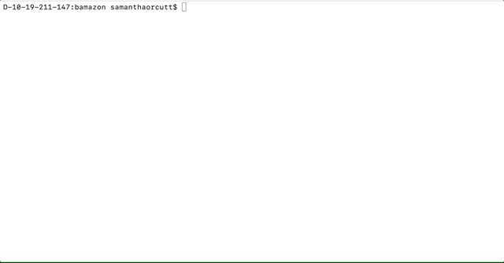
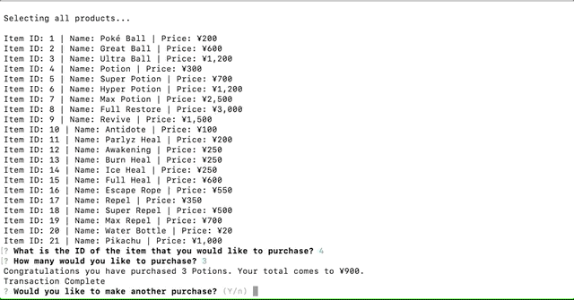
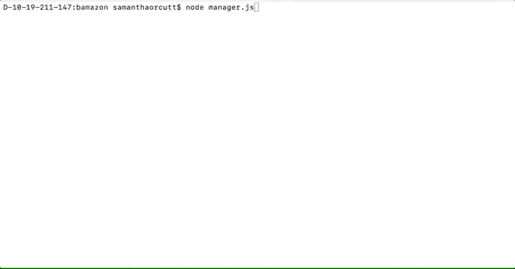
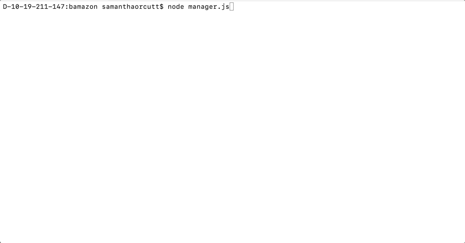
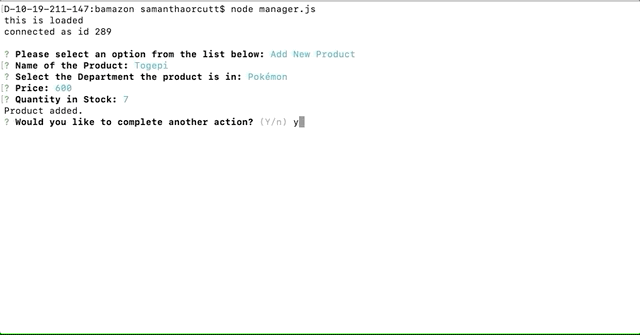

# Poké Mart

Welcome to the Poké Mart the one stop show for all your pokémon needs. 

To get started you will want to create your own .env file with the following information inside. Please replace password123 with your own password. 

```javascript
# mysql API keys

PASSWORD=password123
```

Once that file is created make sure to download the packages required from node with npm install, and then you should be good to go. 

## Customer View Port

Type in node followed by customer.js

From this screen you will be able to view all of the products and place an order. You will then be told if your purchase has been successful or if we do not currently have the stock that you requested. The id that is selected will be confirmed to be a number that is included in the list that is provided, and the value entered will be confirmed to be a valid integer number before it is checked against the stock to se if the items requested can be purchased.

Example of a Successful Purchase:


Example of an Unsuccessful Purchase where the stock requested was not available:


## Manager View Port

Type in node followed by manager.js to use the manager functionality. From the main screen you will see a list of the following options:

### Add New Product
This allows you to add a new product to the inventory. Once clicked on it will prompt you to enter the name of the product the department the product is in the price of the product and the quantity in stock. Once you have successfully entered this information the product will be added to the list of products. 



### Add to Inventory
This allows you to select an item from the items list and then adds whatever number you input to the quantity available for that item in stock. 


###View Low Inventory
When this option is selected it displays for you any items that have a stock quanitty lower than 5.



###View Products for Sale
This allows you to view all products available and information on their ID, Name, Price and Quantity on stock. 



## Supervisor View Port

Type in node followed by supervisor.js. This will then provide you with the 2 following options. 


### View Product Sales by Department & Create New Department
Create a new department allow you to create a new department by inputting the department name and the overhead costs of the department. 

View product sales by department allows you to view an accumulation of all the sales within each department. When a new department has just been created its values will be null unitil there are products added to that department and there have been sales. 

