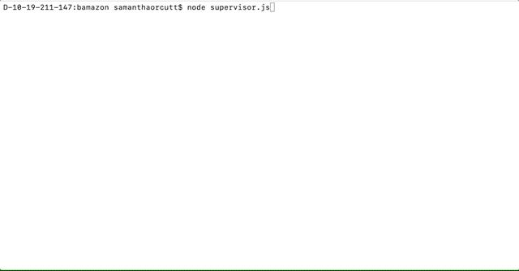

# Poké Mart

Welcome to the Poké Mart the one stop show for all your pokémon needs. 

To get started you will want to create your own .env file with the following information inside. Please replace password123with your own password. 

```javascript
# mysql API keys

PASSWORD=password123
```

Once that file is created make sure to download the packages required from not with npm install, and then you shoudl be good to go. 

## Customer View Port

type in node followed by customer.js

from this screen you will be able to view all of the products and place an order. You will then be told if your purchase has been successful or if we do not currently have the stock that you requested. The id that is selected will be confirmed to be a number that is included in the list that is provided, and the value entered will be confirmed to be a valid integer number before it is checked against the stock to se if the items requested can be purchased.


## Manager View Port

type in node followed by manager.js

From this screen you will be able to:
View Products for Sale
View Low Inventory
Add to Inventory
Add New Product


## Supervisor View Port

type in node followed by supervisor.js

View Product Sales by Department
Create New Department

